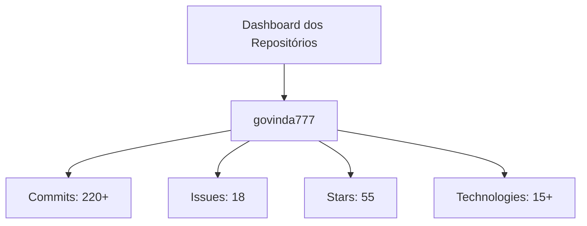
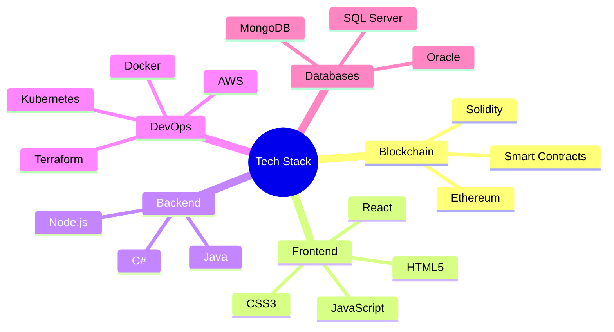
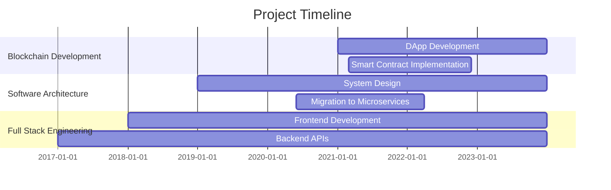
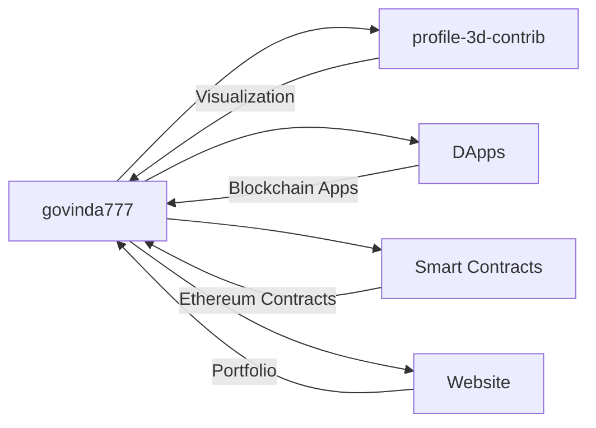
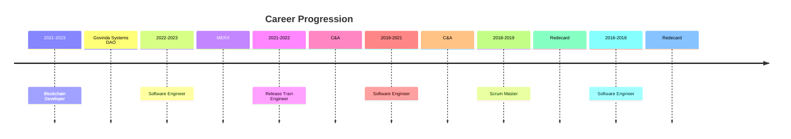
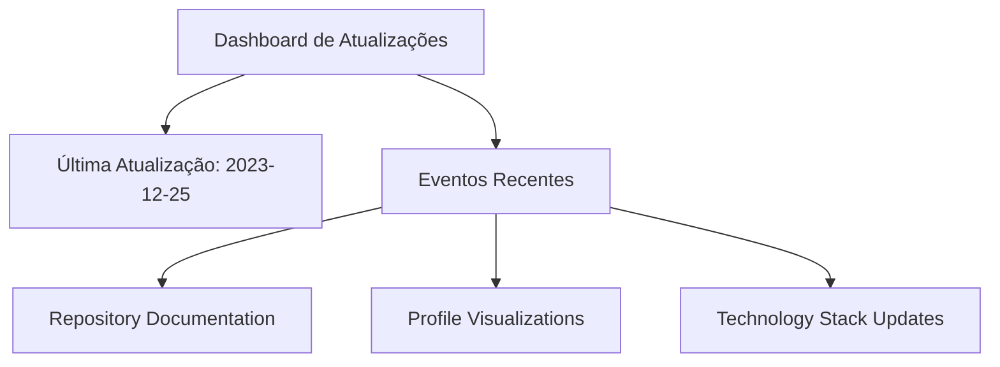

# Govinda Project Dashboard

Welcome to the comprehensive dashboard for Govinda's projects. This dashboard provides real-time insights and visualizations of repository metrics and activities.

## Overview

## Repository Metrics

## Technology Stack

## Activity Visualization

## Project Timeline

## Contribution Patterns

## Repository Relationships

## Professional Experience

## Night View Visualization

## Latest Updates

---

> This dashboard is automatically updated with the latest project metrics and visualizations. The data is generated using [profile-3d-contrib](https://github.com/yoshi389111/github-profile-3d-contrib) and integrated with GitHub metrics.