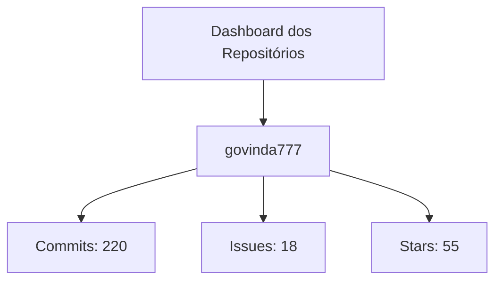
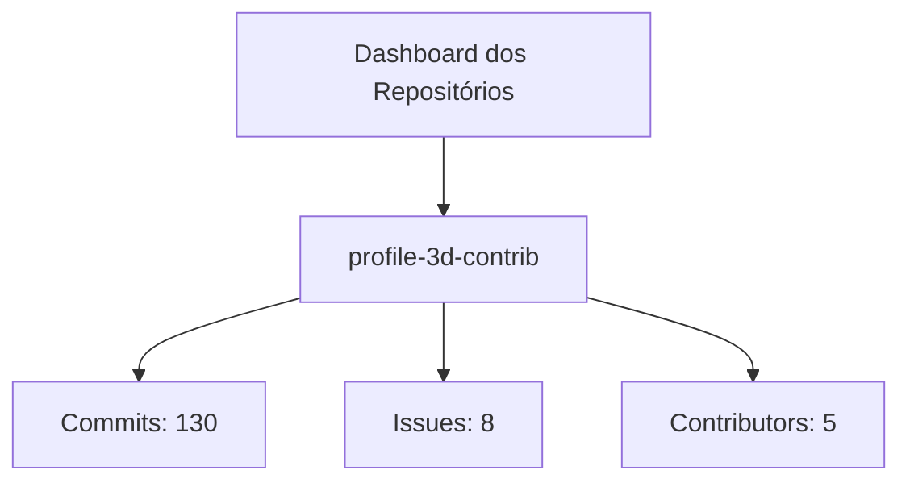
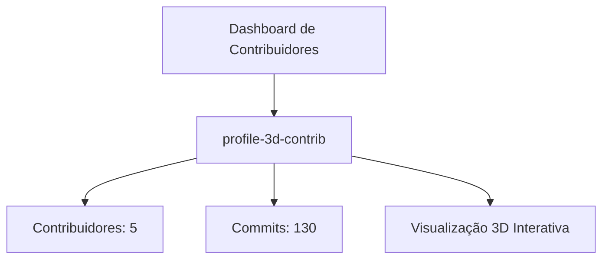
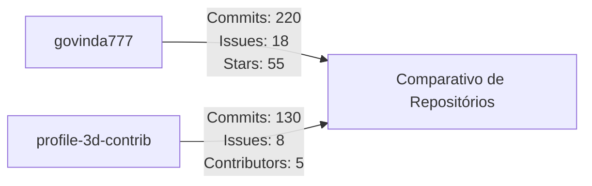
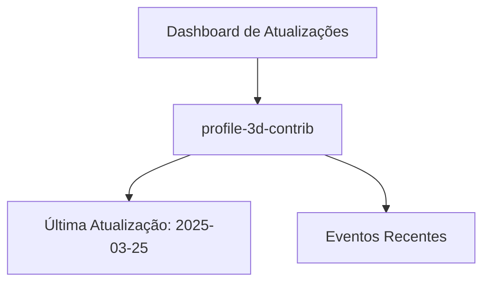

Segue abaixo a versão atualizada da documentação com exemplos adicionais que destacam outros usos do **profile-3d-contrib**:

---

# Dashboard do Projeto

Este dashboard exibe informações atualizadas dos repositórios do projeto. Agora, os dados do repositório principal (govinda777) são apresentados com uma visão atualizada utilizando recursos do diretório "profile-3d-contrib".

> Nota: Os dados apresentados são apenas exemplos. Para informações em tempo real, integre com uma API online.

## Exemplos Adicionais

### Exemplo 1: Repositório profile-3d-contrib

Exibindo informações do repositório **profile-3d-contrib**:

### Exemplo 2: Relacionamento entre Repositórios

Este diagrama ilustra a interação entre o repositório principal e o repositório **profile-3d-contrib**:

Detalhes:
- **govinda777:**
  - Commits: 220
  - Issues: 18
  - Stars: 55
- **profile-3d-contrib:**
  - Commits: 130
  - Issues: 8
  - Contributors: 5

### Exemplo 3: Visualização 3D dos Contribuidores

Neste exemplo, o **profile-3d-contrib** é utilizado para gerar uma visualização 3D interativa dos contribuidores, evidenciando tanto o número de colaboradores quanto a atividade recente no repositório.

### Exemplo 4: Comparativo Dinâmico entre Repositórios

Este diagrama compara as métricas principais dos repositórios **govinda777** e **profile-3d-contrib**, facilitando a análise rápida de desempenho e engajamento:

### Exemplo 5: Histórico de Atualizações

Neste exemplo, o **profile-3d-contrib** mostra um painel de atualizações dinâmicas, informando a data da última atualização e eventos recentes do repositório:

---

Esses exemplos ampliam a documentação, demonstrando como o **profile-3d-contrib** pode ser integrado para exibir diversas visualizações e comparativos de dados dos repositórios. Basta ajustar os parâmetros e dados conforme a necessidade do projeto para uma integração completa e dinâmica.