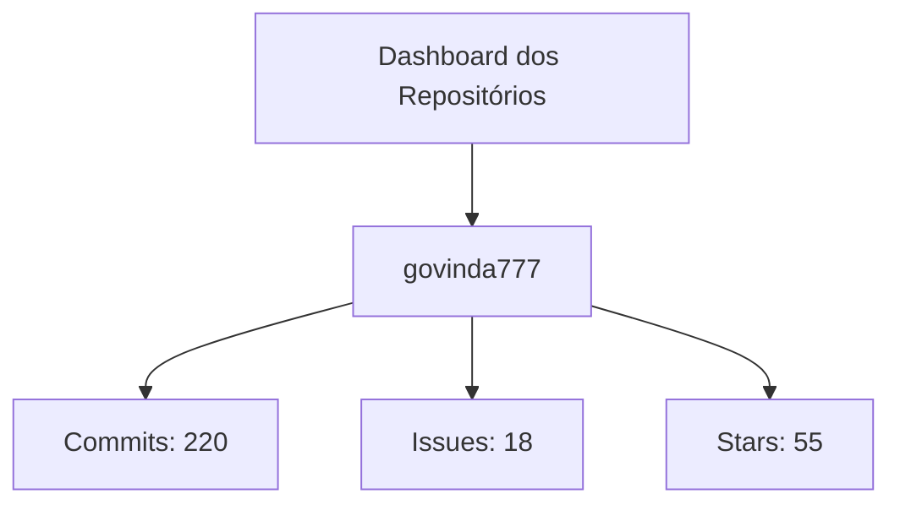
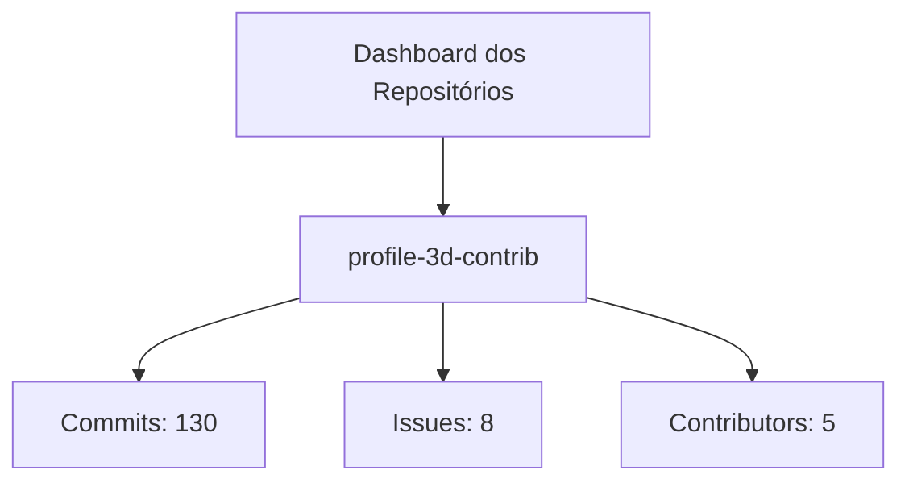
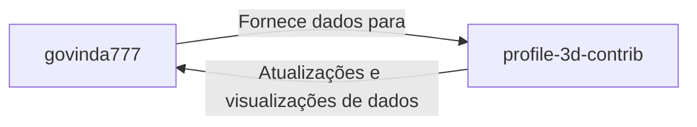

# Dashboard do Projeto

Este dashboard exibe informações atualizadas dos repositórios do projeto. Agora, os dados do repositório principal (govinda777) são apresentados com uma visão atualizada utilizando recursos do diretório "profile-3d-contrib".

> Nota: Os dados apresentados são apenas exemplos. Para informações em tempo real, integre com uma API online.

## Exemplos Adicionais

### Exemplo 1: Repositório profile-3d-contrib

Exibindo informações do repositório **profile-3d-contrib**:

### Exemplo 2: Relacionamento entre Repositórios

Este diagrama ilustra a interação entre o repositório principal e o repositório **profile-3d-contrib**:

Detalhes:
- **govinda777:**
  - Commits: 220
  - Issues: 18
  - Stars: 55
- **profile-3d-contrib:**
  - Commits: 130
  - Issues: 8
  - Contributors: 5