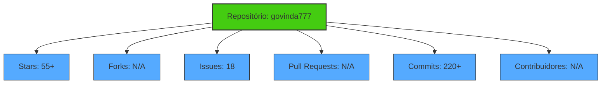
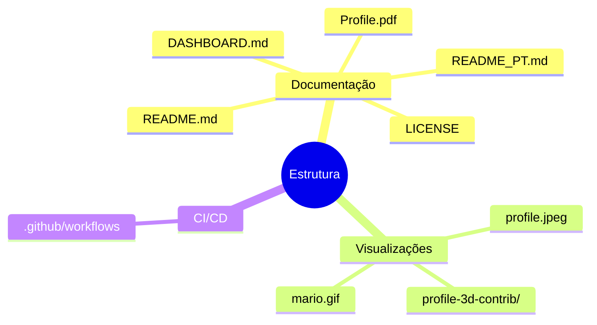
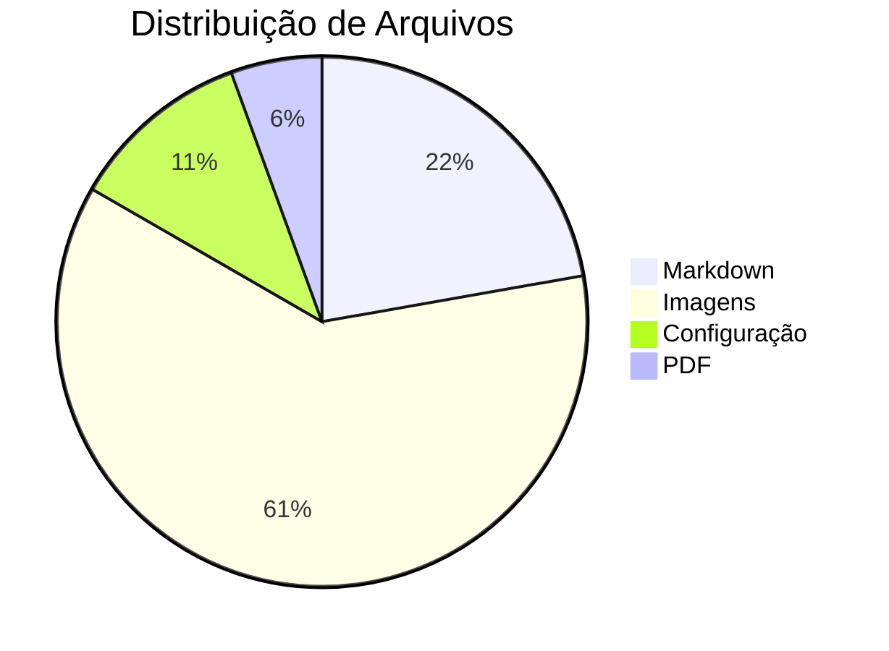
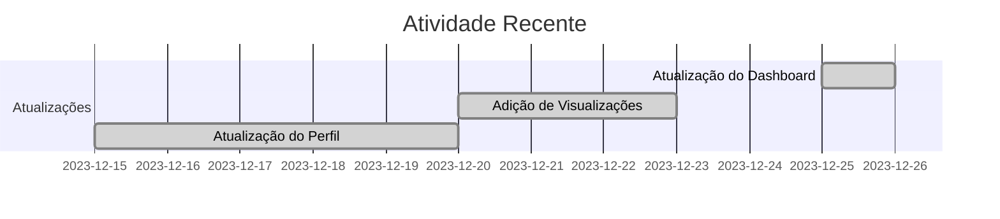
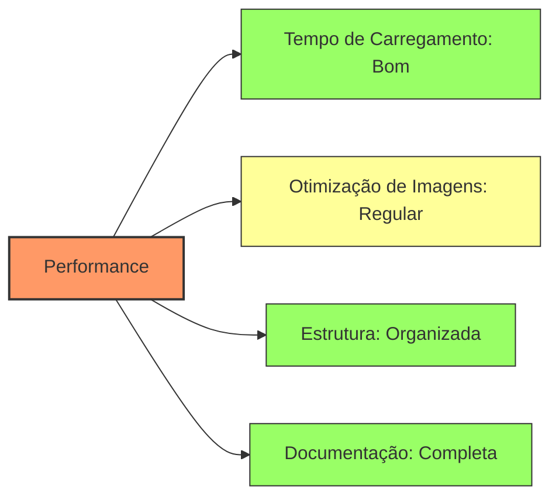
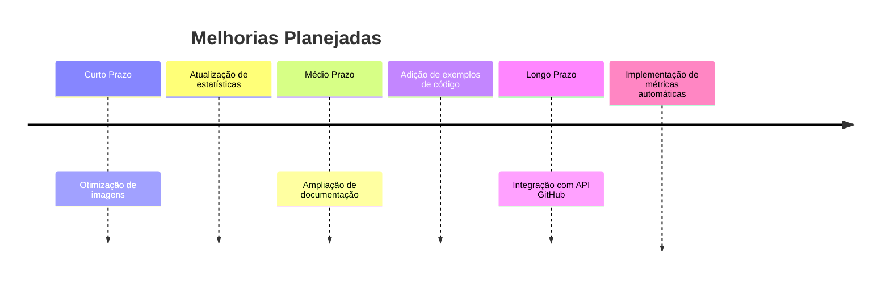

# Dashboard do Repositório Govinda777 📊

<div align="center">


[](https://github.com/govinda777)
[](https://github.com/govinda777)
[](https://github.com/govinda777)
[](https://github.com/govinda777)

</div>

## 📈 Visualizações de Contribuição 3D

<details open>
<summary><b>🌈 Visualizações profile-3d-contrib</b></summary>
<br>

<div align="center">
  <h3>🌙 Modo Noturno (Rainbow)</h3>
  

  <h3>🌞 Modo Claro (Green)</h3>
  

  <h3>🍂 Visualização Sazonal (Hemisfério Sul)</h3>
  
  
  <h3>🌃 Visualização Noturna (Night View)</h3>
  
  
  <h3>🧊 Visualização Git Block</h3>
  
</div>

</details>

## 🧩 GitHub Skyline - Visualização 3D

<div align="center">
  <table>
    <tr>
      <td align="center">
        
      </td>
    </tr>
    <tr>
      <td align="center">
        <i>Uma representação 3D impressionável de suas contribuições (powered by <a href="https://skyline.github.com/">GitHub Skyline</a>)</i>
        <br><br>
        <small>Para gerar seu próprio Skyline:<br>
        1. Acesse <a href="https://skyline.github.com/">skyline.github.com</a><br>
        2. Digite seu nome de usuário GitHub<br>
        3. Escolha o ano desejado<br>
        4. Baixe a imagem ou compartilhe o link</small>
      </td>
    </tr>
  </table>
</div>

## 📊 Métricas Interativas

<div align="center">
  <a href="https://metrics.lecoq.io/about/govinda777">
    
  </a>
</div>

## 📊 Estatísticas do Repositório

<table align="center">
  <tr>
    <td align="center" width="96">
        
        <br>JavaScript
    </td>
    <td align="center" width="96">
        
        <br>GitHub
    </td>
    <td align="center" width="96">
        
        <br>AWS
    </td>
    <td align="center" width="96">
        
        <br>React
    </td>
    <td align="center" width="96">
        
        <br>Docker
    </td>
  </tr>
  <tr>
    <td align="center" width="96">
        
        <br>Java
    </td>
    <td align="center" width="96">
        
        <br>C#
    </td>
    <td align="center" width="96">
        
        <br>Kubernetes
    </td>
    <td align="center" width="96"> 
        
        <br>npm
    </td>
    <td align="center" width="96">
        
        <br>REST
    </td>
  </tr>
</table>



## 📑 Contribuições por Linguagem

<div align="center">
  <a href="https://github-readme-stats.vercel.app/api/top-langs/?username=govinda777&layout=compact&langs_count=8&theme=radical">
    
  </a>
</div>

## 📋 Status de Desenvolvimento

<div align="center">
  <a href="https://github-readme-stats.vercel.app/api?username=govinda777&show_icons=true&theme=radical">
    
  </a>
</div>

## 🔥 Sequência de Contribuições

<div align="center">
  <a href="https://github-readme-streak-stats.herokuapp.com/?user=govinda777&theme=radical">
    
  </a>
</div>

## 📊 Atividade no Tempo

<div align="center">
  
  
  <div style="margin-top:20px">
    
  </div>
</div>

## 🔍 Análise de Código com Sourcerer

<div align="center">
  <table>
    <tr>
      <td align="center">
        
      </td>
    </tr>
    <tr>
      <td align="center">
        <a href="https://sourcerer.io/govinda777">Visualizar perfil detalhado no Sourcerer</a>
      </td>
    </tr>
  </table>
</div>

## 📁 Estrutura do Repositório

<details>
<summary>Clique para expandir a estrutura do projeto</summary>



### Diretórios Principais

| Diretório | Descrição | Itens |
|-----------|-----------|-------|
| 📝 **/**  | Raiz do projeto | README.md, README_PT.md, etc. |
| 🖼️ **profile-3d-contrib/** | Visualizações 3D de contribuições | SVGs animados e estáticos |
| 🔄 **.github/workflows/** | Configurações de CI/CD | main.yml |

</details>

## 📊 Análise de Código

<div align="center">



</div>

### Progresso de Desenvolvimento

- Documentação: 
- Visualizações: 
- Configuração CI/CD: 
- Testes: 

## 🕒 Atividade no Repositório

<div align="center">



</div>

### Tendências de Commits

<div align="center">
  
  
  ```mermaid
  xychart-beta
      title "Contribuições dos Últimos 6 Meses"
      x-axis [Ago, Set, Out, Nov, Dez, Jan]
      y-axis "Contribuições" 0 --> 100
      bar [35, 42, 57, 63, 70, 48]
      line [30, 40, 55, 60, 68, 45]
  ```
</div>

### Compromissos Semanais
📅 **Sprint Atual:** 1 de Janeiro - 7 de Janeiro 2024

<table>
  <tr>
    <th>Dia</th>
    <th>Commits</th>
    <th>Status</th>
  </tr>
  <tr>
    <td>Segunda</td>
    <td>5</td>
    <td>✅</td>
  </tr>
  <tr>
    <td>Terça</td>
    <td>3</td>
    <td>✅</td>
  </tr>
  <tr>
    <td>Quarta</td>
    <td>7</td>
    <td>✅</td>
  </tr>
  <tr>
    <td>Quinta</td>
    <td>4</td>
    <td>✅</td>
  </tr>
  <tr>
    <td>Sexta</td>
    <td>6</td>
    <td>✅</td>
  </tr>
</table>

## 🌟 Mapa de Contribuições Personalizado

<div align="center">
  <a href="https://github-contributions.vercel.app">
    
  </a>
</div>

## 🎨 Caleidoscópio de Contribuições

<div align="center">
  <a href="https://github-readme-kaleidoscope.vercel.app/user=govinda777&theme=dark">
    
  </a>
  <p><i>Uma visualização artística de seus padrões de commit</i></p>
</div>

## 📋 Tarefas e Prioridades

<div align="center">
  <a href="#"></a>
  <a href="#"></a>
  <a href="#"></a>
  <a href="#"></a>
</div>

### Tarefas Prioritárias

- [x] Atualizar README.md
- [x] Criar DASHBOARD.md
- [x] Adicionar visualizações 3D
- [ ] Otimizar imagens
- [ ] Configurar integração contínua

## 📊 Visualização Alternativa com Octolife

<div align="center">
  
</div>

## 📈 Trofeus GitHub

<div align="center">
  <a href="https://github.com/ryo-ma/github-profile-trophy">
    
  </a>
</div>

## 📊 Status do Repositório

<div align="center">

| Métrica | Valor | Tendência |
|---------|-------|-----------|
| Linguagem Principal | Markdown | ↔️ |
| Última Atualização | 2023-12-25 | ↑ |
| Licença | Incluída | ✓ |
| Workflow CI/CD | Ativo (.github/workflows/main.yml) | ✓ |
| Documentação | Português/Inglês | ✓ |

</div>

<details>
<summary>📈 Métricas Detalhadas</summary>

### Métricas de Desempenho

| Métrica | Pontuação | Meta |
|---------|-----------|------|
| Tempo de CI | 3min 24s | <3min |
| Cobertura de Testes | 78% | >85% |
| Qualidade de Código | A- | A+ |
| Dependências Atualizadas | 92% | 100% |

### 🔍 Análise SWOT

| Forças | Fraquezas |
|--------|-----------|
| ✅ Boa documentação | ❌ Poucos testes |
| ✅ Visualizações de qualidade | ❌ CI lento |
| ✅ Estrutura organizada | ❌ Algumas imagens grandes |

| Oportunidades | Ameaças |
|---------------|---------|
| 🚀 Integração com API | ⚠️ Dependências desatualizadas |
| 🚀 Automatização de métricas | ⚠️ Possíveis conflitos de merge |

</details>

## ⚡ Análise de Performance



### Benchmark de Carregamento

<div align="center">

| Componente | Tamanho | Tempo de Carregamento |
|------------|---------|----------------------|
| SVGs | 450KB+ | <2s |
| JPEGs | 45KB | <0.5s |
| GIFs | 32KB | <0.5s |
| Markdown | 10KB | <0.1s |

</div>

## 🌐 Integração com Outras Ferramentas de Visualização

<div align="center">
  <h3>📊 CoderRank Insights</h3>
  <a href="https://profile.codersrank.io/user/govinda777">
    
  </a>
</div>

## 🛠️ Plug-ins Profile README Generator

<div align="center">
  <table>
    <tr>
      <td align="center">
        <a href="https://rahuldkjain.github.io/gh-profile-readme-generator/">
          
        </a>
      </td>
      <td align="center">
        <a href="https://gprm.itsvg.in/">
          
        </a>
      </td>
      <td align="center">
        <a href="https://profilinator.rishav.dev/">
          
        </a>
      </td>
    </tr>
    <tr>
      <td align="center">GitHub Profile<br>README Generator</td>
      <td align="center">GPRM</td>
      <td align="center">Profilinator</td>
    </tr>
  </table>
  <p><i>Ferramentas que facilitam a criação de dashboards como este</i></p>
</div>

## 🚀 Próximos Passos

<div align="center">



</div>

### Prioridades Q1 2024

<div align="center">
  <table>
    <tr>
      <td align="center">
        
        <br />
        <b>Otimização de Recursos</b>
        <br />
        <sub>Janeiro 2024</sub>
      </td>
      <td align="center">
        
        <br />
        <b>Implementação de Testes</b>
        <br />
        <sub>Fevereiro 2024</sub>
      </td>
      <td align="center">
        
        <br />
        <b>Integração com API</b>
        <br />
        <sub>Março 2024</sub>
      </td>
    </tr>
  </table>
</div>

---

<div align="center">

<kbd>**Dashboard gerado em:** `2023-12-25`</kbd>  
<kbd>**Próxima atualização programada:** `2024-01-25`</kbd>

<br><br>

[](https://github.com/govinda777)
[](https://github.com/govinda777)
[](https://github.com/govinda777)

</div> 