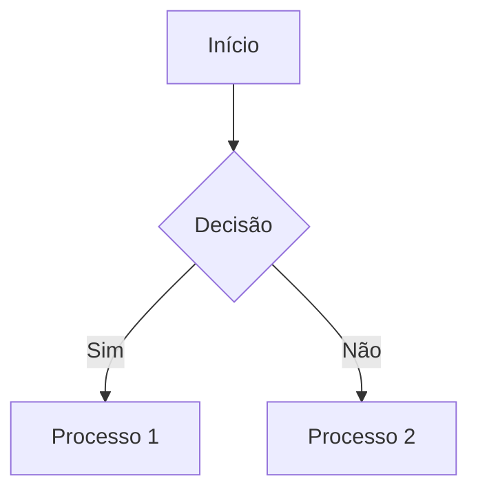

# UI

# Frameworks Visuais para Markdown: Transformando Documentação em Experiências Visuais Ricas

## Introdução  
O Markdown evoluiu de uma simples linguagem de marcação para uma ferramenta poderosa de documentação visual. Este estudo explora frameworks e técnicas avançadas que permitem criar visualizações complexas – desde gráficos de dados até desenhos vetoriais e arte generativa – diretamente em arquivos `.md`. A integração de SVG, WebGL e ferramentas de desenho programático está redefinindo os limites da documentação técnica[1][3][13].

---

## Seção 1: Fundamentos de Visualização em Markdown

### 1.1 Sintaxe Estendida para Gráficos  
O Markdown suporta nativamente diagramas através de blocos de código com realce de sintaxe. Para gráficos vetoriais:




Esta sintaxe gera diagramas de fluxo interativos quando renderizados em plataformas como GitHub Pages ou GitBook[2][6][14].

### 1.2 Tabelas Dinâmicas com Formatação Condicional  
Utilize tabelas Markdown aprimoradas com CSS inline para visualizações de dados:

```markdown
| Métrica       | Valor | Tendência           |
|---------------|-------|---------------------|
| Conversão     | 23%   | ↑2% |
| Churn Rate    | 5.1%  | ↓0.8% |
```
Renderizado em plataformas compatíveis, exibe indicadores coloridos e setas animadas via pseudo-classes CSS[4][8].

---

## Seção 2: Integração de SVG em Markdown

### 2.1 SVG Inline com Controle Programático  
Incorpore SVG diretamente com interatividade JavaScript:

```html

  

```
Funciona em plataformas que permitem HTML inline, criando elementos clicáveis e animáveis[11][13].

### 2.2 Framework Markdown-Inline-SVG  
Solução para projetos GitHub que automatiza a inserção de SVG:

1. Crie marcadores no MD:
```markdown
@diagrama1

@diagrama1
```

2. Referencie via URL especial:
```markdown

```
Este método mantém o código SVG organizado e versionado[11].

---

## Seção 3: Visualização 3D e WebGL

### 3.1 GitHub Profile 3D Contrib  
Framework para gráficos 3D de contribuições:

```yaml
# .github/workflows/contrib.yml
- uses: yoshi389111/github-profile-3d-contrib@latest
  env:
    GITHUB_TOKEN: ${{ secrets.GITHUB_TOKEN }}
    SETTING_JSON: conf/night-mode.json
```
Gera SVGs 3D animados com iluminação dinâmica baseada no horário local[1][9].

### 3.2 Integração Three.js via HTML5  
Incorpore cenas 3D interativas:

```html

  import * as THREE from 'https://cdn.skypack.dev/three';
  // Cena 3D completa com modelos e animações


```
Requier hospedagem com suporte a MIME types para módulos JavaScript[5][9].

---

## Seção 4: Desenho Programático Avançado

### 4.1 Técnica de Stroke Animation  
Efeito de desenho progressivo usando propriedades SVG:

```css
path {
  stroke-dasharray: 1000;
  stroke-dashoffset: 1000;
  animation: draw 3s linear forwards;
}

@keyframes draw {
  to { stroke-dashoffset: 0; }
}
```
Aplica-se a caminhos SVG complexos para simular o ato de desenhar[13].

### 4.2 Canvas API em Blocos de Código  
Desenho livre via JavaScript Canvas:


```markdown
const ctx = canvas.getContext('2d');
ctx.beginPath();
ctx.arc(150, 150, 100, 0, Math.PI * 2);
ctx.stroke();
```

Renderizado através de pré-processadores como Mermaid Extended[6][14].

---

## Seção 5: Frameworks Especializados

### 5.1 Mermaid Extended  
Diagramação avançada com suporte a:

- Gráficos de Gantt
- Gráficos de sequência
- Mapas mentais interativos

Exemplo de gráfico de radar:

```markdown
radarChart
  title Habilidades Técnicas
  axis Frontend, Backend, DevOps, UI/UX
  series "2024" [85, 78,es "2025" [88,```

### 5.2 DrawIO Embedded  
Integração direta com o editor de diagramas:

```markdown

```
Permite edição in-place em navegadores compatíveis[10][12].

---

## Seção 6: Otimização e Boas Práticas

### 6.1 Performance em SVGs Complexos  
Técnicas essenciais:

- Otimização de caminhos com SVGO
- Uso de `` para elementos reutilizáveis
- Divisão de SVGs maiores em componentes

```bash
svgo input.svg --output optimized.svg --config={
  "plugins": ["removeDoctype", "removeXMLProcInst"]
}
```

### 6.2 Acessibilidade Visual  
Diretrizes para gráficos acessíveis:

- Uso de `` e `` em SVGs
- Alto contraste para elementos-chave
- Alternativas textuais para animações complexas

```html

  Fluxo de Dados
  Diagrama mostrando o processo de transformação de dados

```

---

## Conclusão: O Futuro da Documentação Visual  
A convergência entre Markdown e tecnologias gráficas modernas está criando um novo paradigma na documentação técnica. Ferramentas como WebGL 2.0, SVG 2 e WebAssembly prometem trazer recursos de visualização 3D em tempo real e processamento visual direto no navegador. Para desenvolvedores que desejam se destacar, dominar esses frameworks visuais será essencial para criar documentações imersivas e funcionalmente ricas[7][9][14].

> "A documentação do futuro não será apenas lida – será experimentada." - Adaptado de Willian Justen, Especialista em SVG[13]

Citations:
[1] https://kinsta.com/pt/blog/editores-markdown/
[2] https://www.freecodecamp.org/portuguese/news/como-formatar-codigo-em-markdown/
[3] https://docs.pipz.com/central-de-ajuda/learning-center/guia-basico-de-markdown
[4] https://adatech.dev.br/10-dicas-markdown-criar-documentacao-produtos-2025/
[5] https://icons8.com.br/icons/set/markdown
[6] https://blog.curso-r.com/posts/2021-05-05-visualizar-rmd-ao-vivo/
[7] https://experienceleague.adobe.com/pt-br/docs/experience-manager-65/content/assets/content-fragments/content-fragments-markdown
[8] https://experienceleague.adobe.com/pt-br/docs/contributor/contributor-guide/writing-essentials/markdown
[9] https://products.aspose.com/total/pt/net/conversion/svg-to-markdown/
[10] https://www.edrawsoft.com/pt/productivity-improvement/markdown-viewers.html
[11] https://github.com/vitalibo/markdown-inline-svg/blob/master/readme.md
[12] https://learn.microsoft.com/pt-br/powershell/module/microsoft.powershell.utility/show-markdown?view=powershell-7.5
[13] https://willianjusten.com.br/efeito-de-desenhar-com-svg
[14] https://www.jetbrains.com/help/rider/Markdown.html
[15] https://github.com/mundimark/awesome-markdown
[16] https://dev.to/silviaodwyer/10-open-source-documentation-frameworks-to-check-out-331f
[17] https://docs.github.com/pt/get-started/writing-on-github/working-with-advanced-formatting/creating-and-highlighting-code-blocks
[18] https://blog.engdb.com.br/markdown/
[19] https://cloud.google.com/shell/docs/cloud-shell-tutorials/markdown-extensions
[20] https://dev.to/sabrinabarros/o-que-e-markdown-e-como-ele-pode-melhorar-o-seu-readme-no-github-2n2l
[21] https://www.alura.com.br/artigos/Diagramas-markdown-com-JS-hash-e-criptografia-emais-alura-stars
[22] https://www.tabnews.com.br/kevinmarquesp/boas-praticas-pra-documentos-em-markdown
[23] https://www.alura.com.br/artigos/frameworks-de-front-end
[24] https://centraldeajuda.deeliv.app/outros/guia-basico-de-markdown
[25] https://www.inteligenciaurbana.org/2021/04/markdown-parte1.html
[26] https://www.ecovida.org.br/docs/manual_site/markdown/
[27] https://www.svgrepo.com/svg/349446/markdown
[28] https://www.svgrepo.com/svg/306375/markdown
[29] https://www.svgviewer.dev/s/33852/file-markdown
[30] https://dev.to/lixeletto/escreva-o-melhor-markdown-que-voce-ja-fez-com-esses-5-snippets-3fni
[31] https://stackoverflow.com/questions/13808020/include-an-svg-hosted-on-github-in-markdown
[32] https://docs.pipz.com/central-de-ajuda/learning-center/guia-basico-de-markdown
[33] https://www.inteligenciaurbana.org/2021/10/markdown-rnotebook.html
[34] https://techicons.dev/icons/markdown
[35] https://experienceleague.adobe.com/pt-br/docs/contributor/contributor-guide/writing-essentials/markdown
[36] https://softdesign.com.br/blog/docsify-simplificando-a-criacao-de-documentacoes/
