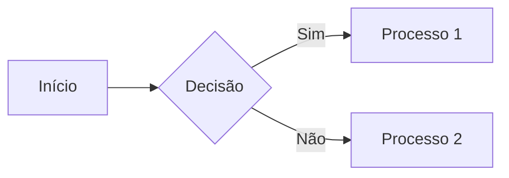
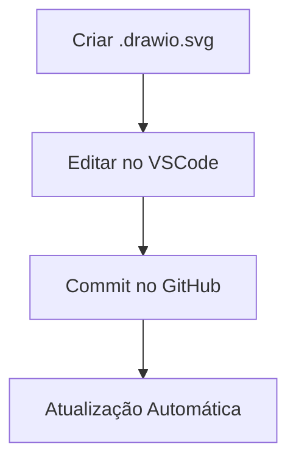

# UI

# Documentação Completa de Componentes Visuais para Markdown

Este guia explora componentes visuais avançados para enriquecer documentações em Markdown, integrando desde gráficos dinâmicos até visualizações 3D interativas. 

---

## 1. Diagramas com Mermaid.js[2][8][9]

### 1.1 Tipos de Diagramas Suportados
- **Flowcharts**: Mapas mentais e fluxogramas
- **Sequence Diagrams**: Interações temporais
- **Gantt Charts**: Cronogramas de projetos
- **Pie Charts**: Distribuição percentual
- **Git Graphs**: Histórico de branches

### 1.2 Sintaxe Básica



![Exemplo Mermaid](https://mermaid.ink/img/eyJjb2RlIjoiZ3JhcGggTFJcbiAgQVtJbsOtY2lvXSAtLT4gQntEZWNpc8OvfVxuICBCIC0tPnxTaW18IENbUHJvY2Vzc28gMV1cbiAgQiAtLT58TsOjb3wgRFtQcm9jZXNzbyAyXSIsIm1lcm1haWQiOnsidGhlbWUiOiJkZWZhdWx0In0sInVwZGF0ZUVka 2. GitHub Profile 3D Contrib[1][3]

### 2.1 Configuração do Workflow
```yaml
name: 3D Contributions
on:
  schedule:
    - cron: "0 18 * * *"
  workflow_dispatch:

jobs:
  build:
    runs-on: ubuntu-latest
    steps:
      - uses: actions/checkout@v4
      - uses: yoshi389111/github-profile-3d-contrib@latest
        env:
          GITHUB_TOKEN: ${{ secrets.GITHUB_TOKEN }}
          SETTING_JSON: conf/night-mode.json
```

### 2.2 Personalização Avançada
Crie `conf/night-mode.json`:
```json
{
  "fileName": "night.svg",
  "backgroundColor": "#00000f",
  "contribColors": ["#1a1a2e", "#16213e", "#0f3460", "#e94560"]
}
```

---

## 3. Charts Dinâmicos com QuickChart[5][6]

### 3.1 Gráficos via URL
```markdown

```

### 3.2 Exemplo Complexo
```markdown

```

---

## 4. Integração com DrawIO[4][7]

### 4.1 Diagramas Editáveis
1. Crie `arquitetura.drawio.svg`
2. Incorpore no Markdown:
```markdown

```

### 4.2 Fluxo de Trabalho


---

## 5. GIFs Animados[5][6]

### 5.1 GIFs Estáticos
```markdown

```

### 5.2 GIFs Gerados por Actions
```yaml
- name: Generate GIF
  uses: jclem/gifify-action@v1
  with:
    input: demo.mp4
    output: demo.gif
```

---

## 6. Dados de Repositório[3][6]

### 6.1 Badges Automáticas
```markdown


```

### 6.2 Estatísticas Avançadas
```markdown
```
pie title Commits por Mês
  "Janeiro": 23
  "Fevereiro": 45
  "Março": 15
```

---

## 7. Componentes Especiais

### 7.1 Heatmaps Interativos
```

```

### 7.2 3D Models (GLTF)
```
![Model 3D](https://modelviewer.dev/shared-assets/mode 8. Best Practices [1][4][6]

1. **Otimização de SVG**: Use SVGO para compressão
   ```
   npx svgo input.svg -o optimized.svg
   ```
2. **Acessibilidade**: Adicione `` em SVGs
3. **Atualização Automática**: Configure schedules nas Actions
4. **Versionamento**: Mantenha assets em `/docs/assets`
5. **Performance**: Limite animações complexas >5MB

---

## 9. Fluxo de Desenvolvimento Visual

```
graph LR
  A[Ideia] --> B[Protótipo no DrawIO]
  B --> C[Implementação no Mermaid]
  C --> D[Testes Locais]
  D --> E[Deploy via GitHub Actions]
  E --> F[Monitoramento de Performance]
```

Este ecossistema permite criar documentações técnicas ricas e interativas, transformando Markdown em uma ferramenta profissional para storytelling técnico.

Citations:
[1] https://ppl-ai-file-upload.s3.amazonaws.com/web/direct-files/61929226/a9283107-9f60-42c6-af6f-08362569f324/paste-1.txt
[2] https://github.blog/developer-skills/github/include-diagrams-markdown-files-mermaid/
[3] https://github.com/yoshi389111/github-profile-3d-contrib
[4] https://dev.to/darraghor/3-markdown-editing-tips-i-wish-i-knew-when-i-started-blogging-1cn0
[5] https://github.com/topics/quickchart
[6] https://daily.dev/blog/github-markdown-badges-explained
[7] https://www.mountainofcode.co.uk/markdown-charts
[8] https://github.com/mermaid-js/mermaid
[9] https://docs.github.com/en/get-started/writing-on-github/working-with-advanced-formatting/creating-diagrams
[10] https://mermaid.js.org
[11] https://mermaid.live
[12] https://callysto.github.io/shorts-book/shorts/GIFs.html
[13] https://docs.github.com/en/actions/monitoring-and-troubleshooting-workflows/monitoring-workflows/adding-a-workflow-status-badge
[14] https://www.youtube.com/watch?v=qGsQolMh9zE
[15] https://github.com/yoshi389111/github-profile-3d-contrib/blob/main/EXAMPLES.md
[16] https://jackiexiao.github.io/foam/recipes/diagrams-in-markdown/
[17] https://quickchart.io/documentation/
[18] https://daily.dev/blog/best-practices-for-github-markdown-badges
[19] https://mdxjs.com
[20] https://stackoverflow.com/questions/34341808/is-there-a-way-to-add-an-animated-gif-to-a-markdown-file
[21] https://learn.microsoft.com/en-us/azure/devops/boards/github/configure-status-badges?view=azure-devops
